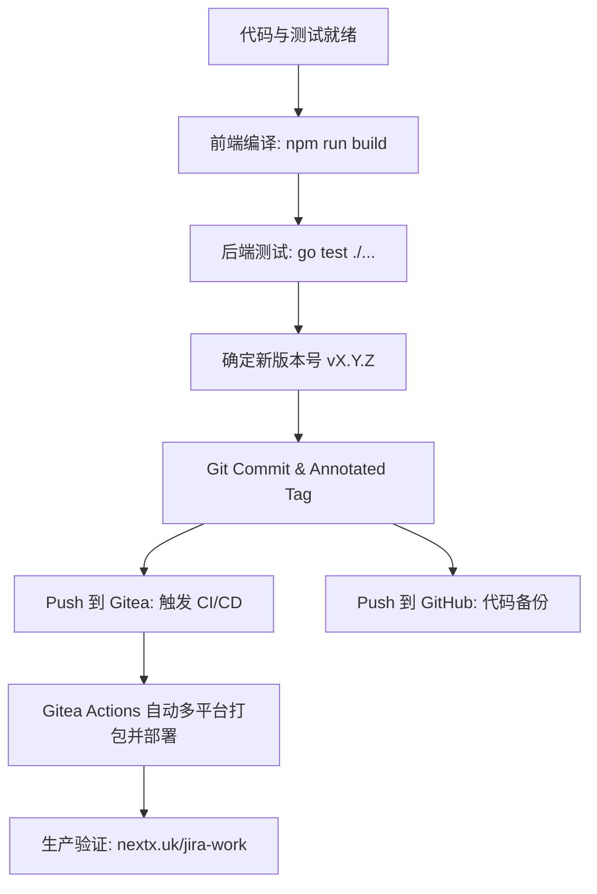

# Jira Workbench 版本发布 Agent 指南 (Release Runbook)

本指南专为 **AI Agent** 和**开发维护者**设计，用于规范化执行 **Jira Workbench** 的版本发布、Git 打标、双远程同步以及自动化 CI/CD 流程。

---

## 1. 发布流程概览 (Release Pipeline)



---

## 2. 第一步：发布前置检查 (Pre-Release Verification)

在创建 Tag 或发布前，**必须**确保代码构建和测试 100% 通过。

### 1. 前端类型检查与构建打包
Jira Workbench 采用单二进制程序打包，前端产物通过 `go:embed` 内嵌在后端中。**必须先编译前端产物**：

```bash
cd web
npm run build
cd ..
```
- ✅ **验证目标**：无 TypeScript 报错（`tsc -b` 通过），产物成功输出至 `internal/web/dist/`。

### 2. 后端单元测试与完整编译
```bash
# 运行全部单元测试
go test ./...

# 验证可执行文件编译
go build -o /dev/null .
```
- ✅ **验证目标**：全部测试包返回 `ok`，主入口顺利编译无报错。

---

## 3. 第二步：版本号决策规范 (SemVer)

### 1. 查询当前最新 Tag
```bash
git tag --sort=-v:refname | head -n 10
```

### 2. 版本号规则 (`v<MAJOR>.<MINOR>.<PATCH>`)
| 变动类型 | 示例场景 | 版本递增规则 | 示例 |
| :--- | :--- | :--- | :--- |
| **PATCH (补丁)** | Bug 修复、UI 细节对齐、文案样式优化、无破坏性小改动 | `PATCH + 1` | `v1.0.5` -> `v1.0.6` |
| **MINOR (次版本)** | 新增功能模块（如新页面、新存储机制、支持新工作流）且向下兼容 | `MINOR + 1, PATCH = 0` | `v1.0.6` -> `v1.1.0` |
| **MAJOR (主版本)** | 破坏性架构升级、底层存储/API 不兼容改造 | `MAJOR + 1, 0, 0` | `v1.1.0` -> `v2.0.0` |

---

## 4. 第三步：提交与打标 (Commit & Tag)

### 1. 暂存与提交代码
```bash
git add .
git status
```
确认已暂存的文件包括：
- 核心修改的代码文件 (`*.go`, `*.ts`, `*.tsx`)
- 嵌入前端产物目录 (`internal/web/dist/`)
- 依赖变动 (`go.mod`, `go.sum`, `package.json` 等)

```bash
# 按照 Conventional Commits 提交，标明核心变更
git commit -m "feat: <简要说明本次版本更新要点>

- 变更点 1
- 变更点 2
- 变更点 3"
```

### 2. 创建附注标签 (Annotated Tag)
**必须使用带注记的标签**（带有签名或发布说明，方便发布日志提取）：
```bash
git tag -a v1.0.X -m "Release v1.0.X: <版本更新总结>"
```

---

## 5. 第四步：双远程推送与 CI/CD 触发 (Multi-Remote Push)

项目配置了双远程仓库，具有不同的职责：
1. **`gitea` (主部署源)**：`https://git.nextx.uk/nextx/jira-work.git`
   - `.gitea/workflows/release.yaml` 监听 `v*` tag，自动编译 Linux/macOS/Windows 多平台二进制并发布到 `https://nextx.uk/jira-work/`。
2. **`origin` (备份源)**：`git@github.com:kingwsi/jira-cli.git`
   - GitHub 代码开源/备份仓库。

### 标准推送命令
```bash
# 1. 先推送到 Gitea（触发自动编译与部署流水线）
git push gitea main && git push gitea v1.0.X

# 2. 同步推送到 GitHub
git push origin main && git push origin v1.0.X
```

---

## 6. 第五步：发布后验证 (Verification & Healthcheck)

推送 Tag 后，执行以下步骤验证发布状态：

### 1. 检查线上版本与元数据
```bash
# 检查线上版本清单是否已更新至新版本
curl -s https://nextx.uk/jira-work/latest/version.json | jq .
```
- ✅ 预期返回：
  ```json
  {
    "version": "v1.0.X",
    "published_at": "..."
  }
  ```

### 2. 检查安装/更新脚本下载地址
```bash
curl -s -I https://nextx.uk/jira-work/install.sh | grep -E "HTTP|content-length"
```

### 3. 应用内自动更新检测验证
当客户端服务运行时，后台更新服务 (`internal/updater`) 会定期或启动时请求 `https://nextx.uk/jira-work/latest/version.json`，检测到新版本时会在终端与 Web 界面提示升级。

---

## 7. 常见问题与异常排查 (Troubleshooting)

### Q1: Gitea 或 GitHub 推送 Tag 被拒绝 (`[rejected] - tag already exists`)
- **原因**：本地 Tag 与远程已有的 Tag 冲突，或本地未拉取最新 Tag。
- **解决**：
  ```bash
  git fetch --tags
  git tag --sort=-v:refname | head -n 5
  # 重新评估并递增一个未使用的版本号
  git tag -d <old-tag>
  git tag -a <new-tag> -m "..."
  ```

### Q2: 编译时报错 `pattern dist/*: no matching files found`
- **原因**：直接运行了 `go build` 但未提前执行前端打包。
- **解决**：先进入 `web` 目录执行 `npm run build`，确保 `internal/web/dist` 生成，再打包 Go。

### Q3: 误打 Tag 或发布中途需要撤回
```bash
# 1. 删除本地 Tag
git tag -d v1.0.X

# 2. 删除 Gitea 远程 Tag
git push gitea --delete v1.0.X

# 3. 删除 GitHub 远程 Tag
git push origin --delete v1.0.X
```
